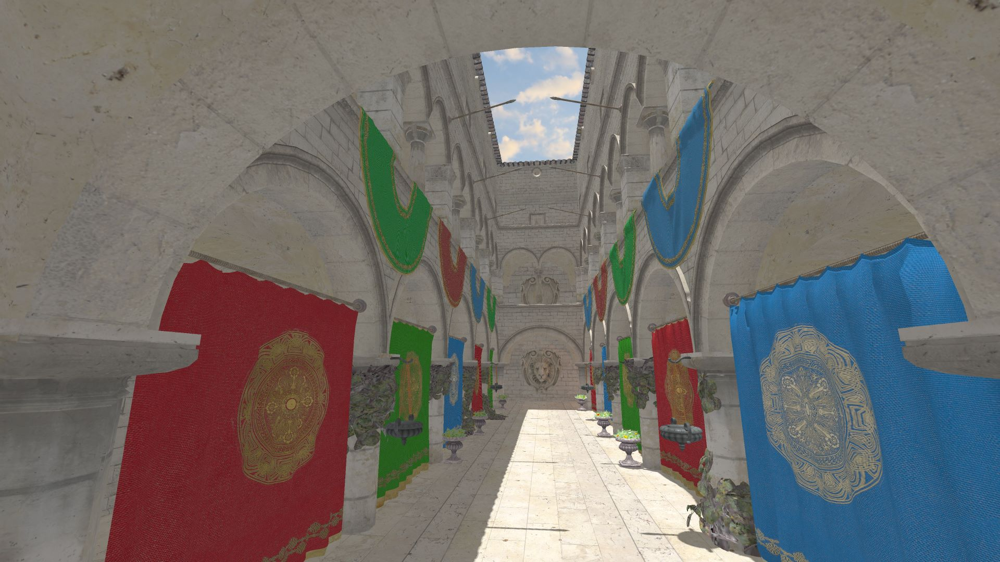
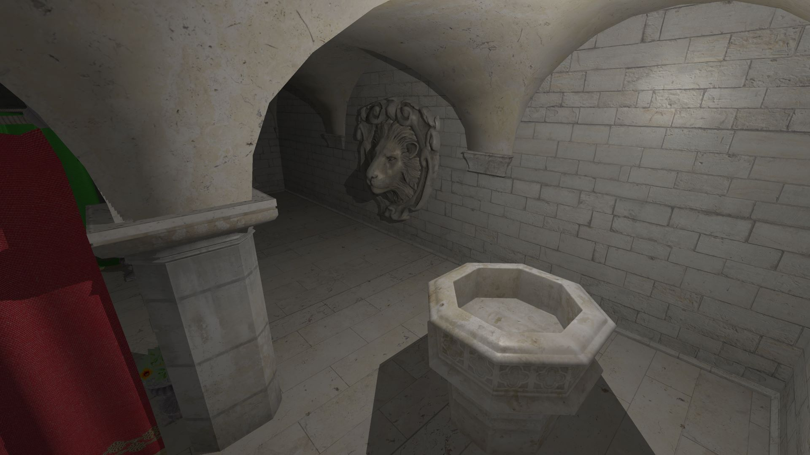

OpenGL 3D Model Viewer
======================

This is a small testbed for OpenGL and/or other basic computer graphics concepts. The code is pretty unorganized, so be aware!

Features
========

- OpenGL 4.5 API
- Assimp Model Loading (.obj, .fbx, .glTF, ...)
- Simple Materials
- Textures
- Shaders
- Directional Light
- Point Lights
- Directional shadow mapping
- Omnidirectional shadow mapping
- Skybox (Cubemap)
- Free-fly camera